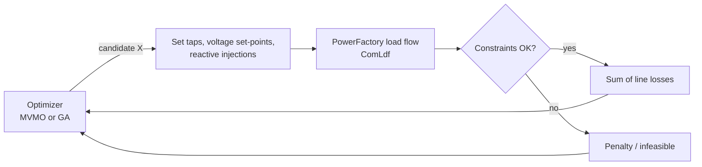

# MVMO_GA

**Minimization of active power losses in IEEE test systems using MVMO and a Genetic Algorithm, run as Python scripts inside DIgSILENT PowerFactory.**


---

## Overview

This repository applies two metaheuristics to the same power-system optimization problem:

- **MVMO** (Mean-Variance Mapping Optimization)
- **GA** (Genetic Algorithm, from [`pymoo`](https://pymoo.org/))

The problem is to **minimize the total active power losses of the lines** by adjusting control variables, with **DIgSILENT PowerFactory** acting as the power-flow engine. For every candidate solution, the script:

1. writes the control variables into the PowerFactory model
2. runs a load flow (`ComLdf`)
3. reads the sum of `c:Losses` over the lines
4. checks the operating limits

Each algorithm is set up for three test systems: **IEEE 6-bus, IEEE 14-bus and IEEE 39-bus**.



## Control Variables and Constraints

| Variable | PowerFactory attribute | Bounds used in the scripts |
|---|---|---|
| Transformer tap position | `nntap` | `9100 – 11100` |
| Generator voltage set-point | `usetp` | `0.9 – 1.1` p.u. (some scripts use `0.8999` / `1.1001`) |
| Reactive power of capacitor banks / generators | `qgini` | `0.1 – PQmax` (`PQmax` = 5 for IEEE 6, 20 for IEEE 14 and 39, 30 for `Gen_0003` in IEEE 14) |

| System | Variables optimized |
|---|---|
| IEEE 6 | 2 taps, 1 generator voltage, 2 capacitor banks |
| IEEE 14 | 5 taps, 1 generator voltage, 3 reactive injections |
| IEEE 39 | 12 taps, 9 generator voltages |

Constraints checked after each load flow: tap limits, generator terminal voltages, reactive injection limits and bus voltages (`m:u` between the voltage bounds).

- **GA**: a solution that breaks a constraint gets a fitness of `1e9`.
- **MVMO**: the check is passed to the optimizer as a constraint function.

## Algorithm Settings

| Setting | MVMO | GA |
|---|---|---|
| Library | `MVMO` (`from MVMO import MVMO`) | `pymoo` (`pymoo.algorithms.soo.nonconvex.ga.GA`) |
| Population | 30 | 30 |
| Iterations | 2000 | pymoo default termination |
| Other | 5 mutations, initial vector `X0` | `eliminate_duplicates=True`, `seed=1` |
| Output | `Total Losses` printed to the PowerFactory output window | Best `X` and `F` printed to the output window |

## Project Structure

```text
MVMO_GA/
├── MVMO_digPF_IEEE6.py    # MVMO – IEEE 6-bus
├── MVMO_digPF_IEEE14.py   # MVMO – IEEE 14-bus
├── MVMO_digPF_IEEE39.py   # MVMO – IEEE 39-bus
├── GA_digPF_IEEE6.py      # GA   – IEEE 6-bus
├── GA_digPF_IEEE14.py     # GA   – IEEE 14-bus
├── GA_digPF_IEEE39.py     # GA   – IEEE 39-bus
├── LICENSE                # MIT
└── _PFD/
    ├── mvmo.pfd           # PowerFactory export file (MVMO)
    └── ga.pfd             # PowerFactory export file (GA)
```

## Requirements

- **DIgSILENT PowerFactory** with Python scripting enabled. The scripts import the `powerfactory` module, so they only run inside PowerFactory.
- Python packages, installed in the interpreter that PowerFactory uses:
  - `numpy`, `autograd` and `pymoo` for the GA scripts
  - the `MVMO` package for the MVMO scripts

## How to Run

The scripts are meant to run as **Python script objects (ComPython) inside a PowerFactory project** that has the matching IEEE network active.

1. Create a Python script object (ComPython) in your study case and point it to the `.py` file. The `_PFD/` folder has the PowerFactory export files (`.pfd`) for each algorithm.
2. Inside the script object, create the **sets** the code reads with `script_fold.GetContents()`:

   | Set name | Contents | Used by |
   |---|---|---|
   | `Stage` | All elements whose attributes are changed | MVMO |
   | `Get_Ref` | All elements whose attributes are changed | GA |
   | `Lines` | Lines whose `c:Losses` are added up | both |
   | `Trafos` | Transformers (tap limits) | both |
   | `Gen` | Generators (terminal voltage limits) | both (not checked in `MVMO_digPF_IEEE39.py`) |
   | `Barras` | Buses (voltage limits) | both |
   | `Cond` | Capacitor banks / reactive sources | MVMO |
   | `Capacitors` | Capacitor banks / reactive sources | GA |

3. Make sure the element names in the model match the names used in the script, e.g. `TRAFO_B3_B5`, `Trf_0004_0007`, `Trf 02 - 30`, `GENERADOR_B2`, `Gen_0002`, `G 01`.
4. Execute the script. The result is printed in PowerFactory's output window.

## Notes and Limitations

- The scripts are tied to specific element names and set names in the PowerFactory models. The network models themselves aren't in this repository.
- In `GA_digPF_IEEE14.py`, `n_var` is set to `5` while the bound arrays have 9 entries.
- In the MVMO scripts, only the first two variables are declared as integers (`integer=[0, 1]`), even in the systems with more transformers.
- Code comments are partly in Spanish.

## Author

**Martin Sanchez** ([@nensanc](https://github.com/nensanc))

## License

This project is licensed under the [MIT License](LICENSE).
